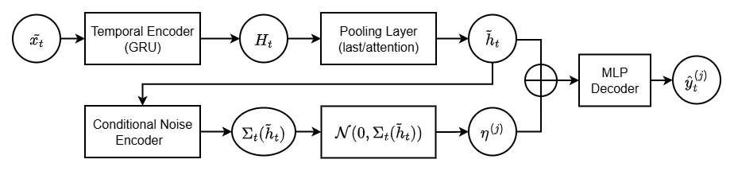
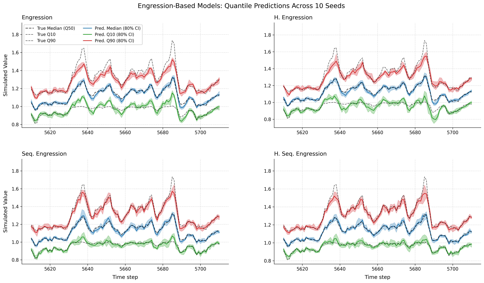

# Time Series Engression

**Modeling Conditional Distributions with Input-Dependent Noise and Temporal Structure**.

Master's Thesis, University of Geneva (2025)  
Author: Yuri Croci | Supervisor: Prof. Dr. Sebastian Engelke


## Overview
This repository contains the implementation of my master's thesis extending **Engression** to time series forecasting. Engression is a distributional regression framework that models full conditional distributions P(Y|X) through pre-additive noise injection, enabling reliable uncertainty quantification and extrapolation beyond training support. My work extends the original framework to temporal data through two main contributions: (1) temporal encoding using GRU architectures with attention-based pooling to capture sequential dependencies, and (2) heteroskedastic noise modeling where prediction uncertainty adapts based on input conditions. The extensions are evaluated through systematic comparison against deterministic baselines and standard Engression variants on both synthetic benchmarks and real-world river discharge data.


<p align="center">
  
</p>

## Key Findings
The proposed extensions demonstrated competitive mean predictions compared to deterministic baselines while providing superior extreme event forecasting capabilities. Key improvements include enhanced tail quantile estimation (10th and 90th percentiles) and adaptive uncertainty quantification in heteroskedastic environments where prediction confidence varies over time. A case study analysis on the 2005 Swiss flood event was conducted to evaluate the practical applicability to real-world extreme event prediction.

<p align="center">
  
</p>

## Dataset

The Swiss river discharge and precipitation data used in this study are **not included** in this repository due to data sharing restrictions. 

These datasets are available to academics upon request from:
- **River discharge**: [Swiss Federal Office for the Environment (FOEN)](https://www.hydrodaten.admin.ch/)
- **Precipitation**: [MeteoSwiss](https://gate.meteoswiss.ch/idaweb)


## Repository Structure

```
├── Grid_Search_results/      # Hyperparameter optimization across all models and experiments
├── Models/                   # All model architectures (Engression variants + deterministic baselines)
├── Modules/                  # Core implementation modules
├── multi_seed_results/       # Cross-seed experimental outputs (10 random initializations)
├── River_Discharge_Study/    # Data preparation and EDA for real-world application
├── Simulation_Study/         # Data generation and EDA for synthetic experiments
├── Thesis_and_Presentation/  # Thesis document and presentation slides
└── Thesis_Figures/           # Selected figures used in thesis
```

<br>

## Citation

```bibtex
@mastersthesis{croci2025timeseries,
  author = {Croci, Yuri},
  title = {Time Series Engression: Modeling Conditional Distributions 
           with Input-Dependent Noise and Temporal Structure},
  school = {University of Geneva},
  year = {2025},
  type = {Master's Thesis},
  note = {Supervisor: Prof. Dr. Sebastian Engelke}
}
```
<br>

**Original Engression framework:**
```bibtex
@article{shen2024engression,
  title={Engression: Extrapolation through the lens of distributional regression},
  author={Shen, Xinwei and Meinshausen, Nicolai},
  journal={Journal of the Royal Statistical Society Series B},
  volume={86},
  number={2},
  pages={305--329},
  year={2024}
}
```
<br>

## License

MIT License
